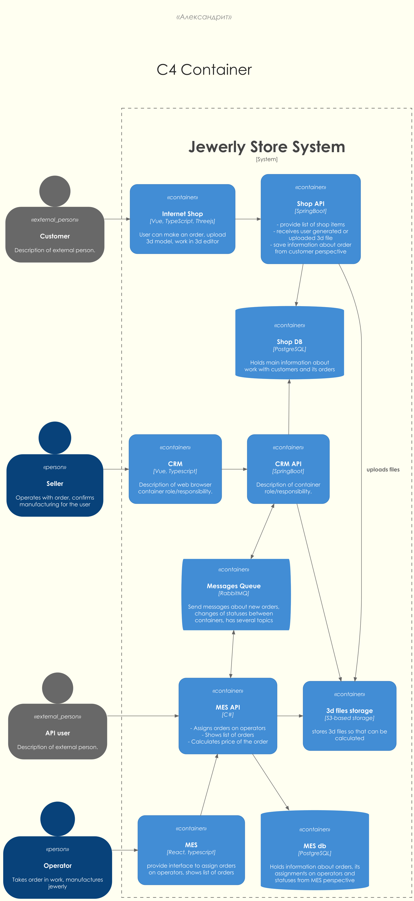
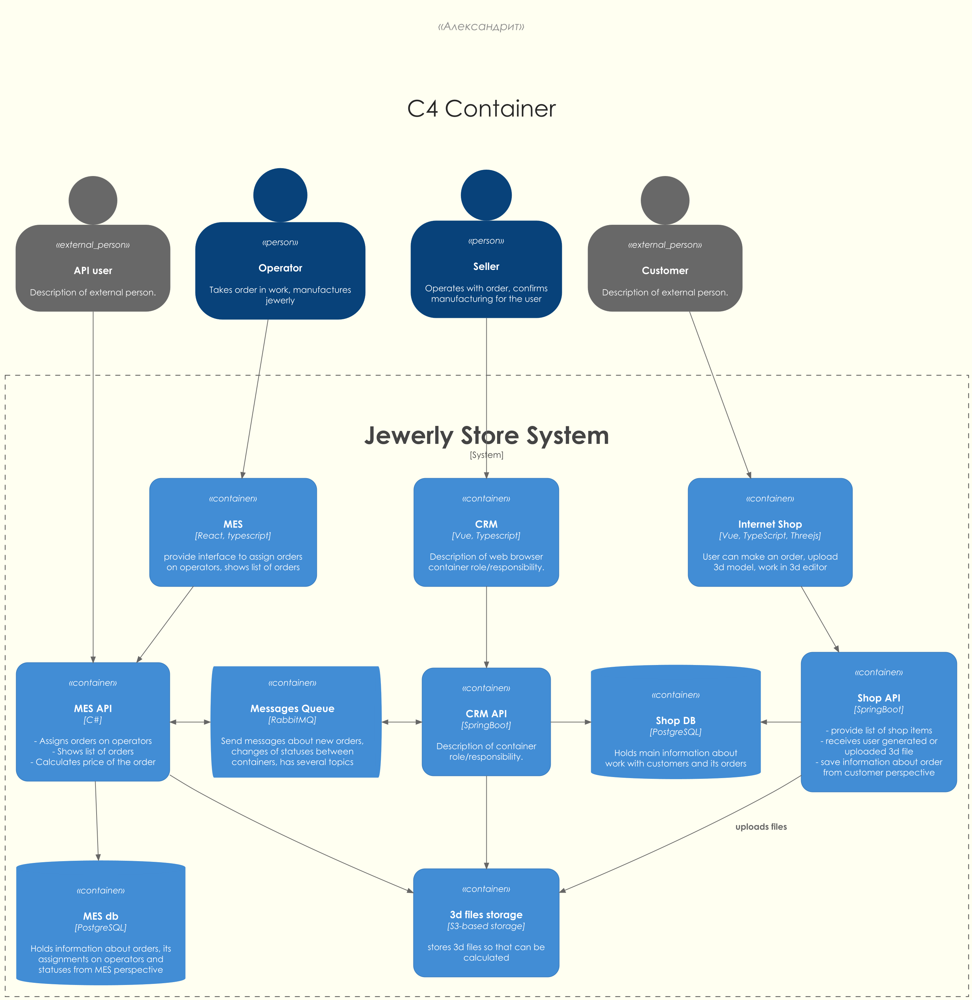
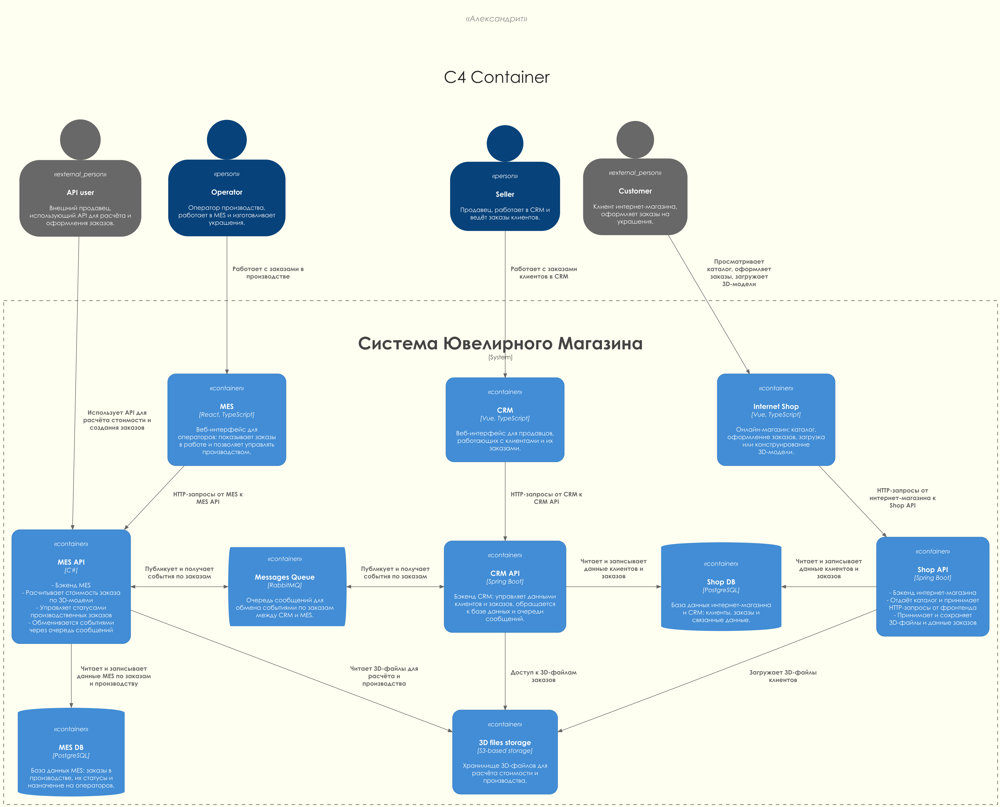
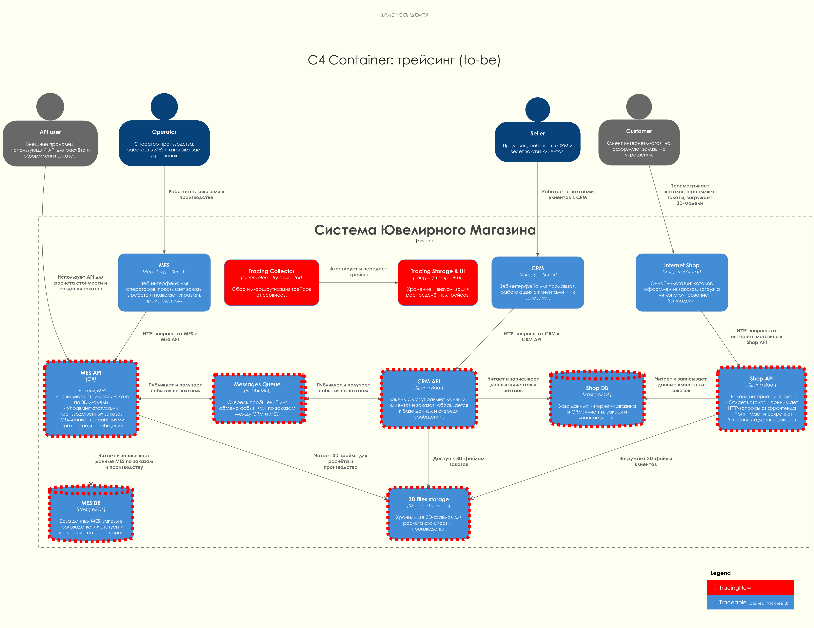
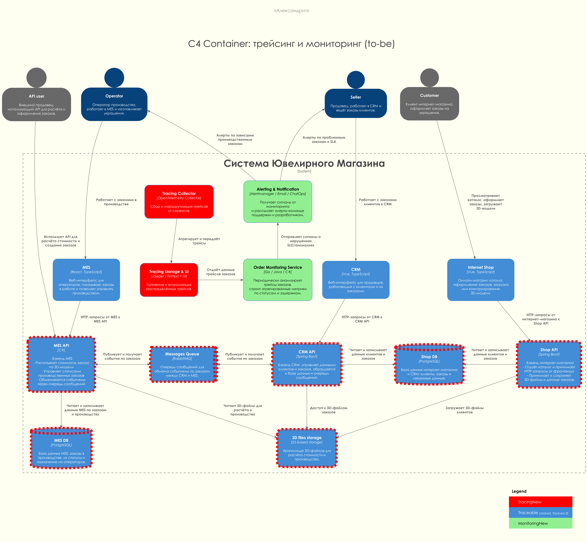

# Задание 3. Архитектурное решение по трейсингу

## Подготовка

В этом задании придётся работать с диаграммой C4. Она уже представлена в файле [../doc/task/jewerly_c4_model.drawio](../doc/task/jewerly_c4_model.drawio).

Для работы с диаграммой её нужно перевести в подходящий формат, привести в соответствие со стандартом C4 и дополнить информацией.

### Недостатки текущей диаграммы

- Орфография и грамматика
    - Используется английский язык, хотя всё задание - на русском
    - Опечатки: "Jewerly" вместо "Jewelry", 3d/3d files вместо 3D files, typescript/Typescript и т.п
    - Непоследовательные формы: "Assigns orders on operators", "Takes order in work"  - фразы читаются неестественно, смешиваются времена и конструкции
- Непоследовательность в именах и технологиях
    - Разные варианты одного и того же: "MES DB" - "MES db", "Vue, TypeScript" - "Vue, Typescript", "Threejs" - "Three.js", "SpringBoot" - "Spring Boot", - разные стили написания названий технологий
- Неоднородные описания контейнеров
    - Часть описаний - подробные списки с дефисами, часть - одна фраза, часть - placeholder-ы вроде "Description of container role/responsibility"
    - Где-то описания заканчиваются точкой, где-то нет. Разные стили перечислений (строка и многострочный список)
- Персоны и их описания
    - Описания Customer, API user, Seller, Operator написаны в разном стиле, с разной степенью детализации, есть грамматические шероховатости
    - Взаимосвязь ролей с контейнерами логична, но текст связей не поясняет сценарии использования
- Отношения (связи) и подписи к ним
    - В изначальной версии связи пересеваются и смешиваются, это сильно снижает читаемость
    - Большинство связей без текстовых меток (кроме, например, "uploads files", что лучше, чем ничего, но тоже не полно), это ухудшает читаемость сценариев
    - Формулировки не всегда следуют C4-подходу "from - to, что/зачем передаём", иногда просто факт связи без смысла

### Конвертация в формат PlantUML

Первым шагом перейдём к концепции документация-как-код и конвертируем диаграмму в PlantUML.
Получилось не идеально и диаграмма слишком вертикальная. Этот факт намекает на то, что для изначальной диаграммы была выбрана некорректная ориентация.

Кроме того, "Flow of information (from - to)" (на изначальной диаграмме) слева-направо гораздо логичнее бы смотрелся "сверху вниз".

Результат - [as-is-0.puml](c4/container/as-is-0.puml):

### Разворот диаграммы для более естественного представления

[as-is-1.puml](c4/container/as-is-1.puml) наглядно демонстрирует, насколько важно при проектировании "проектировать" и саму документацию: чем лучше она структурирована, тем более информативна.

Обратите внимание, **что никакие связи или текст в диаграмме не поменяны**, это строго та же диаграмма, что была изначально в drawio, единственная разница - другое расположение элементов.

### Обогащение диаграммы информацией

Этот шаг уже можно назвать "спорным", т.к. я модифицирую изначальную диаграмму и добавляю туда то, чего там не было.

Тем не менее мне кажется полезным подписать элементы настолько, насколько это позволяет условие задания.

Результат: [as-is.puml](c4/container/as-is.puml)

---

## Анализ системы в контексте трейсинга

### Системы, которые нужно покрыть трейсингом

- **Internet Shop / Shop API**
  - Все B2C-сценарии оформления заказов: `INITIATED`, `FILE_UPLOADED`, `SUBMITTED`
  - Важна привязка фронтенда к бэкенду по одному traceId / correlationId

- **CRM / CRM API**
  - Работа продавцов с заказами и изменение статусов: прежде всего `MANUFACTURING_APPROVED` и `CLOSED`
  - Обработка входящих сообщений от MES через RabbitMQ и создание / обновление заказов

- **MES / MES API**
  - Расчёт стоимости (`PRICE_CALCULATED`) и все производственные статусы:
    `MANUFACTURING_STARTED`, `MANUFACTURING_COMPLETED`, `PACKAGING`, `SHIPPED`.
  - Выбор оператором заказа на дашборде и долгие запросы к списку заказов

- **Очередь сообщений RabbitMQ (`Messages Queue`)**
  - Передача событий между CRM и MES, создание заказов по API-сценарию
  - Критична для поиска потерянных или застрявших сообщений

- **Базы данных (`Shop DB`, `MES DB`)**
  - Фактический источник правды по статусам заказов
  - Важно видеть, кто и когда изменил статус, и как это соотносится с событиями в очереди

- **Хранилище 3D-файлов (`3D files storage`)**
  - Загрузка 3D-моделей и доступ к ним при расчёте стоимости
  - Полезно для диагностики кейсов, когда стоимость так и не была посчитана из-за проблем с файлом

### Где заказ может "сломаться" или зависнуть

- **На стороне интернет-магазина**
  - Заказ остаётся в статусе `INITIATED` или `FILE_UPLOADED` и никогда не доходит до `SUBMITTED`
  - Ошибки при загрузке 3D-модели или передаче данных в `Shop API`

- **При расчёте стоимости в MES**
  - Запрос из `Shop API` в `MES API` зависает или падает по таймауту (особенно для сложных моделей до 30 минут обработки)
  - В MES начался расчёт, но результат не был сохранён или не был отправлен дальше

- **На границе MES - CRM (через RabbitMQ)**
  - Сообщение о `PRICE_CALCULATED` или о производственных статусах потерялось или долго висит в очереди
  - CRM не создаёт или не обновляет заказ по событию из очереди

- **На границе CRM - MES (через RabbitMQ)**
  - CRM утверждает заказ (`MANUFACTURING_APPROVED`), но событие не доходит до MES
  - MES не переводит заказ в `MANUFACTURING_STARTED` или не отображает его операторам

- **Внутри MES на производственных статусах**
  - Оператор взял заказ, но статус не обновился или застрял, дашборд перегружен и не показывает актуальную картину
  - Заказы "теряются" между `MANUFACTURING_COMPLETED`, `PACKAGING` и `SHIPPED`

- **Финальное закрытие заказа в CRM**
  - Сообщение о доставке от транспортной компании или из MES не доходит до CRM
  - Заказ не переходит в `CLOSED`, хотя фактически выполнен и отправлен

### Какие данные должны попадать в трейсинг

- **Идентификаторы и корреляция**
  - **orderId** (внутренний идентификатор заказа во всех системах)
  - **externalOrderId** (для пользователей API, если есть внешний номер)
  - **traceId / spanId** (распределённый трейсинг), **correlationId** для привязки к конкретному заказу
  - Идентификаторы участника: **customerId**, **sellerId**, **operatorId** (где применимо)

- **Информация о статусах заказа**
  - Текущий и предыдущий статус (`INITIATED` - `FILE_UPLOADED` - ... - `CLOSED`)
  - Имя системы-инициатора изменения статуса (Internet Shop / CRM / MES)
  - Время изменения статуса и длительность нахождения в каждом статусе

- **Технические параметры операций**
  - Тип операции (HTTP-запрос, обработка сообщения в очереди, запись в БД, расчёт стоимости)
  - Время выполнения, коды ошибок/ответов, ключевые параметры (например, размер 3D-модели)
  - Статус обработки сообщения в очереди (получено, подтверждено, повторная попытка, DLQ)

- **Данные для поддержки и аналитики**
  - Признак B2C/B2B-сценария (через тип канала: интернет-магазин или API)
  - Привязка к окружению (`dev` / `release` / `prod`)
  - Минимально необходимый контекст для воспроизведения проблемы, без чувствительных данных

---

## Мотивация

- **Сокращение времени поиска "застрявших" заказов**
  - Сейчас команда не понимает, где именно пропал заказ (магазин, CRM, MES, очередь)
  - Трейсинг позволяет за минуты ответить на вопрос "где мой заказ?" и показать полный путь заказа по системам

- **Уменьшение количества жалоб и потерь заказов**
  - Прозрачный путь заказа помогает быстрее чинить ошибки в процессах и интеграциях
  - Можно оперативно находить узкие места (очереди, долгие запросы к MES, проблемы с БД)

- **Снижение нагрузки на поддержку и разработчиков**
  - Вместо ручного поиска по логам и БД поддержка открывает трейс и видит всю историю заказа
  - Уменьшается время на разбор инцидентов и количество обращений к разработчикам

- **Лучшее понимание работы системы под нагрузкой**
  - Видно, на каких шагах заказ проводит больше всего времени и где узкие места при росте нагрузки
  - Это даёт основу для дальнейших архитектурных улучшений (кеширование, расширение инфраструктуры, оптимизация БД)

- **Улучшение бизнес-метрик**
  - Доля заказов с нарушенными SLO по срокам выполнения
  - Среднее время до обнаружения проблемы с заказом (MTTD) и до её устранения (MTTR)
  - Количество проблемных заказов, по которым невозможно восстановить историю

---

## Предлагаемое решение

### Общий подход

- **Распределённый трейсинг на основе OpenTelemetry**
  - Инструментировать ключевые бэкенды (`Shop API`, `CRM API`, `MES API`) с помощью SDK OpenTelemetry
  - Добавить автоматическую трассировку HTTP-запросов, обращений к БД и взаимодействий с RabbitMQ
  - Для фронтендов (`Internet Shop`, `CRM`, `MES`) - по мере необходимости подключить JavaScript-SDK OpenTelemetry для начала трейсов с пользовательских действий

- **Единый трейс для одного заказа**
  - При создании заказа в интернет-магазине или при вызове API генерируется **traceId** и **correlationId**, которые прокидываются:
    - в HTTP-заголовках между фронтендами и API
    - в заголовках сообщений RabbitMQ между `CRM API` и `MES API`
    - в событиях изменения статусов заказа

- **Выделенный контур для хранения и визуализации трейсов**
  - Использовать стек уровня **OpenTelemetry Collector - хранилище трейсов (Jaeger/Tempo) - UI (Jaeger/Grafana)**
  - Все сервисы отправляют трейс-данные в локальный/централизованный OpenTelemetry Collector, который агрегирует и передаёт их в хранилище

### Новые компоненты

- **Tracing Collector**
  - Принимает трейс-данные от `Shop API`, `CRM API`, `MES API` и, опционально, фронтендов
  - Выполняет базовую фильтрацию, агрегацию и маршрутизацию данных в хранилище трейсов

- **Tracing Storage & UI**
  - Хранилище трейсов (например, Jaeger или Tempo) и интерфейс для просмотра цепочек вызовов
  - Позволяет по `orderId`, `traceId` или `correlationId` увидеть полный путь заказа по всем системам

Дабы избежать типичной ошибки "диаграмма обо всём" и её следствия "паутина стрелочек" на диаграмме сделано следующее:

- Система трейсинга отражена отдельными элементами и выделена красным для заметности
- Все трассируемые системы обведены красным пунктиром и снабжены тегом Traceable. Все контейнеры с тегом Traceable логически отправляют трейсы в Tracing Collector
- Стрелки от трассируемых систем до системы трассировки не отображены

Диаграмма контейнеров с трейсингом: [to-be.puml](c4/container/to-be-tracing.puml)

### Интеграция с существующими системами

- **Shop API / CRM API / MES API**
  - Добавить middleware/интерсепторы для автоматического создания спанов на входящих/исходящих HTTP-запросах
  - Внедрить клиентские библиотеки OpenTelemetry для отправки трейсов в Tracing Collector
  - При изменении статуса заказа создавать отдельный спан или event с указанием `orderId`, старого и нового статуса, источника изменения

- **RabbitMQ (`Messages Queue`)**
  - При публикации сообщений добавлять заголовки с trace-контекстом (traceId, spanId, correlationId, orderId)
  - На стороне потребителей восстанавливать контекст трейса и продолжать его новыми спанами
  - Отмечать в трейсе технические проблемы (многократные ретраи, попадание сообщения в DLQ)

- **Базы данных (`Shop DB`, `MES DB`)**
  - Включить трейсинг SQL-запросов (через JDBC-инструментацию, ADO.NET и пр.), ограничивая объём данных, чтобы не логировать чувствительное
  - При изменении статуса заказа убедиться, что в трейсе видно, к какой записи и из какого сервиса было обращение

### Нефункциональные аспекты трейсинга: sampling и ретеншн

- **Sampling (выборка трейсов)**
  - В `dev` и `release` окружениях - 100% выборка, чтобы упростить отладку
  - В `prod` - базовая выборка 10-20% для "нормальных" запросов с возможностью повышать sampling для проблемных сервисов или типов операций (например, для заказов с большой длительностью расчёта стоимости)
  - Для ошибок (5xx, таймауты, падения обработчиков очереди) трейсы всегда записываются независимо от общего уровня sampling

- **Ретеншн (срок хранения трейсов)**
  - В `prod` трейсы хранятся 7-14 дней: этого достаточно, чтобы разбирать типичные инциденты и не переплачивать за хранилище
  - В `dev` / `release` можно хранить трейсы дольше (например, до 30 дней) для анализа регрессий и долгих цепочек поставки
  - Старые данные агрегируются в метрики более высокого уровня (например, распределения времени по статусам заказа), но сами трейсы удаляются

---

## Компромиссы

- **Невозможно "дотянуться" до внешних систем API-пользователей**
  - Мы не можем инструментировать внешние системы, поэтому для них опираемся на заголовки `X-Request-ID` / `X-Correlation-ID` и внутренний `orderId`
  - Для полноценного end-to-end трейса нужно будет договариваться с партнёрами, это может занять время, если вообще возможно
  - Ожидаемый формат заголовков от внешних клиентов: всегда передавать `X-Request-ID` (UUID) и, по возможности, `X-Correlation-ID`. Если заголовки отсутствуют или некорректны, `MES API` генерирует корректный traceId/correlationId и фиксирует расхождение в логах/трейсе

- **Дополнительная нагрузка и сложность инфраструктуры**
  - Появляется новый контур (Collector + хранилище трейсов), который нужно поддерживать и мониторить
  - При некорректной настройке возможны накладные расходы по CPU/памяти и сети

- **Не всё получится покрыть сразу**
  - В первую очередь имеет смысл инструментировать: `MES API`, `CRM API`, `Shop API` и все взаимодействия через RabbitMQ
  - Фронтенд-трейсинг и детальную трассировку БД можно внедрять поэтапно, чтобы не перегружать команду и инфраструктуру

- **Приоритизация внедрения трейсинга по очередям**
  1. `MES API` + RabbitMQ - максимальный вклад в снижение числа "зависших" производственных заказов и жалоб операторов.
  2. `CRM API` - уменьшение жалоб клиентов и партнёров на пропавшие/не закрытые заказы (`MANUFACTURING_APPROVED`, `CLOSED`).
  3. `Shop API` - контроль полного пути B2C-заказа и более точные ответы поддержки B2C-клиентам.
  4. Фронтенды и БД - улучшение разработческой диагностики и тонкая оптимизация производительности.

---

## Аспекты безопасности

- **Доступ к системе трейсинга**
  - Доступ к UI трейсов только для сотрудников с ролями поддержки, разработчиков, тимлида и DevOps
  - Аутентификация через корпоративный сервер / единый реестр учётных записей

- **Работа с чувствительными данными**
  - В трейсах не должны передаваться персональные данные клиентов и содержимое 3D-моделей
  - Параметры запросов и полезные нагрузки должны маскироваться или исключаться из записи, оставляя только технический контекст

- **Разделение окружений и ограничение доступа**
  - Для `dev`, `release` и `prod` - отдельные инстансы/наборы трейс-хранилищ или хотя бы отдельные tenants/namespace
  - Доступ к продакшн-трейсам более жёстко ограничен и протоколируется

---

## Дополнительное задание: автоматический мониторинг и алертинг

#### Идея

На базе данных трейсинга построить автоматический мониторинг прохождения заказа по статусам и алертинг при нарушении SLO и аномалиях:

- отслеживать "зависшие" заказы (слишком долго в одном статусе, особенно `PRICE_CALCULATED` - `MANUFACTURING_APPROVED`, `MANUFACTURING_STARTED` - `SHIPPED`, отсутствие `CLOSED`)
- отслеживать рост ошибок интеграций (ошибки при обработке сообщений в RabbitMQ, таймауты запросов в `MES API` и `CRM API`)
- сигнализировать бизнесу и техподдержке заранее, до массовых жалоб клиентов

#### Предлагаемое решение для мониторинга и алертинга

- **Order Monitoring Service**
  - Периодически (например, раз в 1-5 минут) запрашивает агрегированные данные по трейсам из `Tracing Storage & UI`
  - Строит метрики по времени прохождения заказа между статусами и по доле ошибок/таймаутов для ключевых шагов
  - Сравнивает значения с заданными SLO (например, время от `SUBMITTED` до `PRICE_CALCULATED` не более 30 минут, от `MANUFACTURING_STARTED` до `SHIPPED` не более 3 недель)

- **Alerting & Notification**
  - Получает события от `Order Monitoring Service` при нарушении порогов или обнаружении аномалий (скачок ошибок, резкий рост времени обработки)
  - Рассылает алерты в выбранные каналы: почта, корпоративный мессенджер, интеграция с системой инцидент-менеджмента

- **Примеры правил и сигналов**
  - Более N заказов находится в одном статусе дольше X минут/часов/дней  - напрямую влияет на бизнес-SLO по времени от `SUBMITTED` до `PRICE_CALCULATED` и от `MANUFACTURING_STARTED` до `SHIPPED`
  - Доля ошибок при обработке сообщений в очереди превысила порог - отражается на доле заказов, которые не доходят до `MANUFACTURING_APPROVED` или `CLOSED`
  - Время расчёта стоимости в `MES API` превысило допустимое SLO для значимой доли заказов - влияет на скорость ответа API-клиентам и конверсии в оплату

- **Распределение алертов по ролям**
  - **Операторы (MES)**: получают алерты о зависших производственных заказах и задержках между `MANUFACTURING_STARTED` и `SHIPPED`
  - **Продавцы / поддержка (CRM)**: получают алерты о заказах, которые долго не переходят в `PRICE_CALCULATED`, `MANUFACTURING_APPROVED` или `CLOSED`
  - **Техкоманда (тимлид, DevOps, разработчики)**: получают алерты о системных сбоях (рост ошибок в `MES API`/`CRM API`/очереди, недоступность трейс-хранилища), чтобы снижать MTTR

#### Диаграмма для дополнительного задания

Новый вариант диаграммы контейнеров (trace + мониторинг/алертинг): [to-be-monitoring.puml](c4/container/to-be-monitoring.puml)

На диаграмме:

- элементы, связанные с трейсингом, выделены красным, как и ранее
- новые элементы для мониторинга и алертинга (`Order Monitoring Service`, `Alerting & Notification`) выделены зелёным цветом
- связи между системой трейсинга и контуром алертинга отражают только ключевой поток: "трейсы - анализ - алерт"

