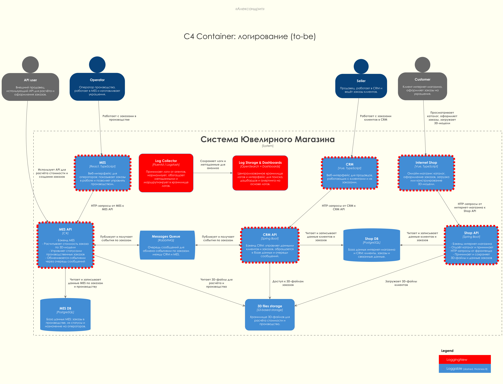

# Задание 4. Архитектурное решение по логированию

---

## Анализ системы компании и C4-диаграммы в контексте планирования логирования

### Какие системы покрываем логированием

В фокусе логирования находятся те же ключевые компоненты, что и в заданиях по мониторингу и трейсингу:

- Интернет магазин:
  - фронтенд интернет магазина
  - Shop API (Spring Boot)
- CRM:
  - фронтенд CRM
  - CRM API (Spring Boot)
- MES:
  - фронтенд MES
  - MES API (C#)
- Интеграции:
  - продюсеры и консюмеры сообщений RabbitMQ между CRM и MES
  - обработчики сообщений, которые создают и обновляют заказы
- Дополнительно:
  - сервис расчета стоимости внутри MES
  - граничные компоненты для внешних партнеров (внешний API)

Физические БД и RabbitMQ не будут писать логи напрямую в общую систему, мы собираем их логи через приложения или стандартные интеграции, но основным источником данных для анализа бизнес проблем остаются логи приложений.

### Формат логов и общие требования

- Единый формат, предпочтительно JSON
- Обязательные поля для всех лог записей:
  - timestamp
  - level
  - service (shop api, crm api, mes api, frontend shop, frontend crm, frontend mes, integration)
  - env (dev, release, prod)
  - correlationId (сквозной идентификатор цепочки обработки)
  - traceId или spanId (если есть трейсинг, для связки логов и трейсов)
  - requestId (идентификатор конкретного запроса в пределах сервиса)
  - orderId (если действие относится к заказу)
  - userId, partnerId или operatorId, sellerId (если есть аутентифицированный субъект)
  - channel (b2c, b2b_api, internal)
  - message (краткое текстовое описание)
  - context (объект с дополнительными полями)

### Список логов уровня INFO

Ниже перечислены ключевые события уровня INFO, сгруппированные по классам компонентов.

#### 1. Изменение статуса заказа во всех системах (Shop API, CRM API, MES API)

- что логируем:
  - orderId
  - previousStatus
  - newStatus
  - sourceSystem (shop, crm, mes)
  - actorType (customer, seller, operator, system)
  - actorId (если есть)
  - причина изменения (manual, api, integration, retry и т.п.)
- где логируем:
  - Shop API при переходах `INITIATED`, `FILE_UPLOADED`, `SUBMITTED`
  - MES API при `PRICE_CALCULATED`, `MANUFACTURING_STARTED`, `MANUFACTURING_COMPLETED`, `PACKAGING`, `SHIPPED`
  - CRM API при `MANUFACTURING_APPROVED` и `CLOSED`

#### 2. Создание заказа (Shop API, CRM API, внешнее API)

- что логируем:
  - orderId и, если есть, externalOrderId
  - channel (b2c, b2b_api)
  - partnerId для партнерских заказов
  - основные параметры заказа (тип изделия, состав и материалы, признак сложной 3d модели, ориентировочная стоимость, страна доставки без точного адреса)
- где логируем:
  - Shop API
  - CRM API при создании заказа из сообщений от MES
  - Внешний API (по возможности) или на гейте до партнёров

#### 3. Входящие и исходящие запросы внешнего API для партнеров (агрегированно)

- что логируем:
  - partnerId
  - тип операции (расчет стоимости, создание заказа, проверка статуса)
  - итоговый HTTP статус
  - latencyBucket (например, < 1s, 1-5s, 5-30s, > 30s)
  - признак успеха или ошибки
- где логируем:
  - сервис внешнего API (mes api или отдельный gateway, в зависимости от реализации)

#### 4. События работы очередей RabbitMQ (интеграции MES и CRM)

- что логируем:
  - публикация сообщения:
    - exchange, routingKey, queue
    - messageType (orderCreated, priceCalculated, statusChanged и т.п.)
    - orderId, correlationId
  - обработка сообщения:
    - consumerService
    - результат обработки (success, retried, sentToDlq)
    - количество попыток
- где логируем:
  - CRM API
  - MES API
  - отдельные интеграционные воркеры, если есть

#### 5. Запуск и завершение расчета стоимости (модуль pricing внутри MES)

- что логируем:
  - orderId
  - calculationId
  - размер и характеристики 3d модели в обезличенном виде (число полигонов, примерный вес файла)
  - старт и окончание расчета, итоговая длительность
  - результат (успешно, ошибка, отмена)
- где логируем:
  - MES API и/или модуль расчета стоимости

#### 6. Операции операторов и продавцов (MES frontend и API, CRM frontend и API)

- что логируем:
  - вход оператора в систему MES и открытие дашборда заказов (агрегировано)
  - выбор заказа оператором в работу
  - ручное вмешательство продавца или администратора в CRM (изменение статуса, форсированное закрытие, перенос сроков)
  - идентификатор пользователя, orderId, тип действия и его результат
- где логируем:
  - фронтенд MES и MES API (операторские действия и работа дашборда)
  - фронтенд CRM и CRM API (ручные изменения статусов и вмешательства продавцов)

#### 7. Технические события уровня INFO (все backend сервисы)

- что логируем:
  - старт и остановка сервисов
  - деплой новой версии (service, version, env)
  - смена конфигурации, влияющей на обработку заказов (лимиты очередей, параметры rate limiting, настройки ретраев)
- где логируем:
  - Shop API, CRM API, MES API
  - отдельные интеграционные воркеры (если вынесены в отдельные процессы или сервисы)

Эти логи позволяют восстановить весь жизненный цикл заказа и сопоставить действия пользователей, внутренних сервисов и интеграций.

#### 8. Логирование на фронтендах (интернет магазин, CRM, MES)

На фронтендах (Vue интернет магазина и CRM, React MES) логирование используется более экономно, чтобы не перегружать сеть и хранилище, но при этом давать поддержку при расследовании проблем.

Основные события:

- js ошибки и необработанные исключения:
  - тип и сообщение ошибки (без включения чувствительных данных)
  - сокращенный stack trace, если доступен
  - версия фронтенда, окружение, тип браузера
- сбои запросов к API:
  - endpoint (укрупненно, без чувствительных параметров)
  - http статус
  - время ответа (latencyBucket по аналогии с backend)
  - correlationId и requestId, если доступны
- важные пользовательские шаги:
  - нажатие кнопки "Оформить заказ" (включая повторные нажатия)
  - повторная отправка формы после ошибки или таймаута
  - явная отмена пользователем (закрытие формы, отказ от операции)

Фронтенды отправляют эти события в легковесный endpoint логирования на соответствующем backend (shop api, crm api, mes api), далее они попадают в общий контур логирования с теми же correlationId и traceId, что и backend события.

### Другие уровни логирования и когда их использовать

- DEBUG:
  - детальная отладочная информация, включается точечно на окружениях dev и release
  - в prod включается только временно и локально для расследования сложных инцидентов
  - не должен содержать чувствительные данные
- INFO:
  - основная бизнес хронология и ключевые технические события
  - события, которые пригодятся для расследования инцидентов, аудита и построения агрегатов
- WARN:
  - деградация, но не фатальная ошибка, когда можно продолжить работу:
    - превышение порогов времени обработки, но с успешным завершением
    - временная недоступность зависимого сервиса с успешным retry
    - подозрение на некорректный ввод данных пользователя или партнера
- ERROR:
  - ошибки, повлекшие отказ операции:
    - необработанные исключения
    - падения обработчиков сообщений
    - попадание сообщений в dead letter queue
    - невозможность записать заказ или статус в БД
  - каждая запись ERROR должна содержать:
    - тип ошибки
    - ключевые идентификаторы (orderId, partnerId, correlationId)
    - упрощенную трассу стека или ссылку на нее
- FATAL:
  - ошибки, при которых сервис не может продолжать работу и будет перезапущен или не может запуститься:
    - нет доступа к критической БД (MES DB, Shop DB)
    - не удается подключиться к RabbitMQ вообще
    - не читается основной конфигурационный файл или секреты
    - обнаружено повреждение или несогласованность критичных данных конфигурации
    - невозможность восстановить соединение с каждой из обязательных зависимостей после серии ретраев
    - сервис несколько раз подряд падает по одной и той же причине при старте или при одинаковой операции
    - обнаружено, что логика обработки заказов находится в заведомо неконсистентном состоянии (ассерты)
    - системные ошибки (segfault, OOM, kernel RCU stall), когда сервис не может физически выполниться
  - Запись FATAL подсвечивает критичные для бизнеса события и должна давать максимум контекста для быстрой диагностики:
    - тип и код ошибки
    - название сервиса, env, instanceId
    - причина остановки (например, "db connection failed after 10 retries", "migrations failed", "rabbitmq not reachable")
    - ключевые параметры (имя БД, имя очереди, версия схемы, версия сервиса)
    - признак того, что сервис:
      - либо сейчас завершает работу
      - либо будет перезапущен оркестратором (systemd, Kubernetes, autoscaling group и т.п.)

---

## Мотивация

### Зачем нужно логирование

- Сократить время расследования инцидентов:
  - сейчас многое восстанавливается по словам клиента и ручным запросам в БД
  - централизованные структурированные логи по всем сервисам позволяют перейти от часов и дней расследований к минутам
- Улучшить прозрачность жизненного цикла заказа:
  - возможность быстро ответить на вопрос где заказ и что с ним происходило
  - возможность увидеть, на каком шаге чаще всего возникают ошибки и задержки
- Поддержать инициативы по мониторингу и трейсингу:
  - логи с correlationId и traceId замыкают треугольник наблюдаемости (metrics, logs, traces)
  - из алертов по метрикам и трейсам можно переходить к конкретным логам для глубокой диагностики
- Снизить нагрузку на поддержку и разработчиков:
  - понятные дашборды и шаблонные поисковые запросы по логам позволят части сотрудников саппорта разбирать инциденты без участия команды разработки
  - появится база знаний по типовым ошибкам и их проявлению в логах

### Технические и бизнес метрики, на которые влияет логирование

Примеры целевых метрик:

- среднее время расследования инцидента по заказу (от обращения до понимания причины до исправления)
- доля инцидентов, по которым не удалось установить причину из за отсутствия данных (меньше - лучше)
- количество обращений в поддержку по вопросам вида "где мой заказ?" при наличии всех систем в работоспособном состоянии
- количество повторных обращений по одному и тому же заказу
- доля технических инцидентов, пойманных по логам и алертам до массовых жалоб клиентов

### Приоритеты по системам для логирования и трейсинга

Команда не может одновременно внедрить полное логирование и трейсинг во всех системах, поэтому приоритизация такая:

1. MES API и интеграция MES с CRM через RabbitMQ:
   - именно здесь больше всего жалоб (задержки дашборда, зависшие статусы производства)
   - каждый сбой напрямую бьет по срокам выполнения заказов
   - логи и трейсинг дадут максимальный эффект для операторов и бизнеса
2. CRM API:
   - финальные статусы `MANUFACTURING_APPROVED` и `CLOSED` определяют, что заказ фактически выполнен
   - ошибки на этом уровне приводят к рассинхронизации с реальным состоянием производства и доставки
   - важно фиксировать все изменения статусов и интеграции с транспортной компанией
3. Внешний API и Shop API:
   - критично для партнеров и для первичного создания заказов
   - хорошее логирование уменьшит количество спорных ситуаций с партнерами и позволит точнее оценивать нагрузку
   - логирование нужно хотя бы на уровне агрегаций и ключевых ошибок
4. Фронтенды и остальные вспомогательные компоненты:
   - полезны для улучшения UX и отладки, но менее критичны по сравнению с бэкендами и интеграциями
   - внедряются поэтапно после стабилизации ядра

---

## Предлагаемое решение

### Архитектурный контур логирования

Предлагается централизованный контур логирования, связанный с уже предложенными в заданиях 2 и 3 решениями по мониторингу и трейсингу.

- Все приложения пишут структурированные логи в `stdout` или локальные файлы
- На каждом инстансе сервиса работает лог агент (например, Filebeat, Fluent Bit или аналогичный), который:
  - читает логи сервисов
  - добавляет технические метки (host, instanceId, env)
  - отправляет логи в централизованный лог-коллектор
- Лог коллектор передает данные в хранилище логов (например, Elasticsearch или OpenSearch)
- Над хранилищем логов используется UI (Kibana, OpenSearch Dashboards или аналог) для:
  - интерактивного поиска и фильтрации
  - построения дашбордов и сохраненных запросов
  - настройки оповещений по паттернам в логах

Ответственность за эксплуатацию и доступность стека логирования (агенты, collector, хранилище, UI) несет DevOps / платформа, а за правила логирования в коде сервисов (что и как логировать) отвечает ведущий разработчик / архитектор.

Логи по возможности обогащаются:

- correlationId, traceId
- id заказа и пользователя
- тип канала и партнера
- ключевые бизнес атрибуты (тип операции, статус, код доменной ошибки)

### Диаграмма логгирования

Для отражения логирования на C4 диаграмме контейнеров применим ту же маркировку, как и для трейсинга:

- добавим в диаграмму централизованный стек логирования: Log Collector и Log Storage + Dashboards
- отметим логируемые приложения и компоненты отдельным тегом `Loggable`, чтобы не перегружать диаграмму стрелками
- подразумеваем, что контейнеры с тегом Loggable (у них красная граница) отправляют структурированные логи в Log Collector по единому контракту логирования

Результат: [c4/container/to-be-logging.puml](c4/container/to-be-logging.puml)

### Политика безопасности для логов

- Минимизация чувствительных данных:
  - в логи не попадают персональные данные клиентов (ФИО, полный адрес, контактные данные)
  - в логи не попадает содержимое 3d моделей и любые бинарные данные
  - поля, которые могут содержать чувствительные или персональные данные, либо не логируются, либо маскируются или хешируются
- Разделение доступа:
  - доступ к логам продакшн окружения имеют только разработчики, DevOps и сотрудники поддержки с соответствующей ролью
  - используем ролевую модель в системе логов (ролевой read only для поддержки, расширенные права только у ограниченного круга инженеров)
  - каждое обращение к системе логов авторизовано и при протоколируется для аудита
- Разделение окружений:
  - для dev, release и prod используются отдельные индексы и, по возможности, отдельные кластеры или tenants
  - доступ к prod логам ограничен сильнее, чем к dev и release
- Шифрование:
  - трафик между лог агентами, коллектором и хранилищем логов защищен (TLS)
  - хранилище логов использует шифрование данных на диске

### Политика хранения логов

- Структура индексов:
  - разбиение по окружению и по основным системам (пример формата названий):
    - `logs-<envtype>-<system>-<year>-<month>`
    - `logs-prod-shop-api-yyyy-MM`
    - `logs-prod-crm-api-yyyy-MM`
    - `logs-prod-mes-api-yyyy-MM`
    - `logs-prod-integrations-yyyy-MM`
- Сроки хранения:
  - продакшн:
    - технические логи (без привязки к заказам) 14-30 дней
    - бизнес логи по заказам 60-90 дней (согласуется с бизнесом и юристами)
  - dev и release:
    - меньшее время хранения или меньший объем, так как используются в основном для отладки
    - можно использовать маркеры по задачам и стирать только тогда, когда лог действительно не нужен для экономии
- Управление объемом:
  - настройка ретеншн политик и автоматического удаления старых индексов
  - возможное использование горячих и теплых индексов (быстрые диски для свежих логов, более дешевые для старых)

### Политика ограничения объема логов и семплирование

- Агрегация части INFO событий:
  - для высокочастотных операций (например, массовые проверки статуса через внешнее API) часть логов уровня INFO фиксируется агрегировано:
    - суммарное количество запросов и ошибок за интервал
    - распределение латентности по диапазонам
  - одиночные подробные записи используются для редких или проблемных сценариев
- Семплирование повторяющихся ошибок:
  - для наиболее частых однотипных ошибок допускается семплирование:
    - полная запись создается один раз в N случаев
    - для остальных увеличивается счетчик occurrences и сохраняется агрегированная статистика
  - это снижает объем логов без потери информации о типе и частоте ошибки
- Ограничения DEBUG в prod:
  - по умолчанию DEBUG в prod выключен
  - временное включение DEBUG в prod:
    - выполняется только по согласованию с ответственным за систему
    - ограничено по времени и объему (sample rate)
    - по окончании расследования возвращается прежний уровень логирования

### Интеграция с мониторингом и трейсингом

- Из метрик (Prometheus, Alertmanager) при срабатывании алерта можно переходить по correlationId, orderId или traceId в систему логов
- Из системы трейсинга (Jaeger, Tempo) по traceId можно открыть отфильтрованные логи по соответствующему запросу или цепочке
- В логах обязательно присутствуют поля correlationId и traceId, чтобы связать все три слоя наблюдаемости

---

## Необходимые мероприятия для превращения системы сбора логов в систему анализа логов

Чтобы система логирования стала действительно полезным инструментом анализа, а не просто хранилищем строк, нужно выполнить следующие шаги:

### 1. Стандартизация логов

- Описать соглашения по логированию в виде внутреннего стандарта:
  - обязательные поля и их формат
  - правила именования событий и типов ошибок
  - примеры хороших и плохих сообщений
- Добавить линтеры и проверки в код ревью:
  - отсутствие логирования чувствительных данных
  - наличие ключевых идентификаторов в важнейших логах

### 2. Готовые дашборды и сохраненные запросы

- Подготовить набор готовых дашбордов и поисковых запросов:
  - дашборд по ошибкам, сгруппированным по сервисам, endpoint и доменным кодам
  - дашборд по заказам с фильтрами по статусам, partnerId, каналам
  - дашборд по интеграционным ошибкам RabbitMQ и DLQ
- Шаблонные поисковые запросы для поддержки:
  - найти все события по orderId
  - найти все ERROR и WARN по partnerId за последний день
  - найти все заказы, для которых есть ERROR при переходе в конкретный статус

### 3. Алертинг на основе логов

- Для части проблем удобнее опираться именно на логи, а не только на метрики:
  - всплеск однотипных ERROR по определенному endpoint
  - появление новых типов ошибок (классификация по коду или тексту ошибки)
  - резкое увеличение количества бизнес ошибок определенного типа
- Настроить алерты в системе логов:
  - пороговые правила (например, больше N ошибок в минуту по определенному шаблону)
  - правила, основанные на трендах (рост количества ошибок относительно среднего значения)
- Интегрировать алерты с уже используемыми каналами уведомлений (мессенджеры, почта, система тикетов)

### 4. Обучение команды и внедрение практик

- Провести короткие воркшопы для:
  - разработчиков (как и что логировать, примеры шаблонов сообщений)
  - поддержки и продукт менеджера (как искать по логам, как пользоваться дашбордами)
- Описать типовые сценарии использования логов:
  - как разбирать жалобу клиента по заказу
  - как искать причину всплеска ошибок внешнего API
  - как сопоставлять логи, метрики и трейсы

### 5. Постепенное улучшение качества логов

- Ввести практику регулярного пересмотра:
  - раз в спринт просматривать, какие логи оказались полезными или избыточными
  - убирать шумные и бессмысленные записи
  - добавлять недостающие поля или события
- Удерживать баланс:
  - достаточно информации для анализа
  - но без излишнего объема, который удорожает хранение и создает шум

### 6. Связь логов с процессом поддержки

Чтобы логирование реально помогало поддержке, а не было только инструментом для разработчиков, описываем несколько типовых сценариев работы саппорта.

Сценарий 1. Расследование жалобы "где мой заказ":

- оператор поддержки получает от клиента номер заказа или иные идентификаторы
- по orderId находит:
  - все записи в логах по этому заказу во всех системах
  - историю изменений статусов
  - технические ошибки и повторные попытки обработки
- далее:
  - определяет текущий статус и систему, на которой заказ завис
  - при необходимости эскалирует в разработку уже с приложенным набором логов и кратким резюме

Сценарий 2. Массовые ошибки внешнего API:

- мониторинг или алерты по логам фиксируют всплеск ошибок при вызовах внешнего API
- саппорт:
  - по partnerId и типу операции находит все ERROR и WARN за интересующий период
  - формирует сводку для партнера (какие операции, какие ошибки, в какие интервалы времени)
  - при необходимости передает в разработку выборку логов и гипотезы (например, рост RPS, новые payload форматы)

Сценарий 3. Эскалация в разработку с подготовленными логами:

- саппорт заводит задачу в трекере, к которой прикладывает:
  - ссылки на сохраненные запросы в системе логов
  - список затронутых заказов, партнеров, интервалов времени
  - краткое описание шаблона ошибки (по агрегированным логам)
- разработчик может быстро перейти от задачи к конкретным логам и, при необходимости, к трейсам и метрикам без повторного поиска

### 7. План поэтапного внедрения логирования

Для удобства реализации и снижения рисков внедрение логирования разбивается на несколько этапов.

Этап 1. MES API и интеграции с CRM через RabbitMQ:

- реализовать structured logging и обязательные поля для:
  - MES API
  - интеграционных обработчиков сообщений между MES и CRM
- включить логирование:
  - статусов производственных этапов
  - работы очередей RabbitMQ (публикация, потребление, DLQ)
  - запуска и завершения расчета стоимости

Этап 2. CRM API:

- внедрить structured logging для CRM API
- логировать:
  - изменения статусов `MANUFACTURING_APPROVED` и `CLOSED`
  - интеграции с транспортной компанией и внешними системами
  - все ошибки, ведущие к рассинхронизации статусов

Этап 3. Внешний API и Shop API:

- внедрить логирование для:
  - внешнего API (gateway) партнеров
  - Shop API
- реализовать:
  - агрегированное логирование запросов партнеров (latency, коды ответов, распределение по partnerId)
  - логирование создания заказов и ошибок валидации на входе

Этап 4. Фронтенды и настройка алертинга:

- добавить логирование ключевых событий на фронтендах (js ошибки, неудачные запросы, важные пользовательские действия)
- связать frontend логи с backend через correlationId
- донастроить алерты на основе логов:
  - по всплескам ошибок
  - по появлению новых типов ошибок
  - по аномалиям в бизнес событиях (резкий рост определенных шаблонов неуспешных операций)

Общая координация работ по внедрению логирования и контролю качества логов возлагается на архитектора (совместно с ведущими разработчиками), а эксплуатацией инфраструктуры логов занимается DevOps / платформа.

---

## Дополнительное задание: критерии для выбора технологии для работы с логами

Ниже приведен пример сравнения технологий по основным критериям. Конкретный выбор зависит от ограничений компании, но таблица помогает обосновать решение.

| Критерий | ELK (Elasticsearch + Logstash + Kibana) | OpenSearch | Splunk | Grafana Loki | Облачный лог сервис (например, Yandex Cloud Logging) |
| -------: | :-------------------------------------: | :--------: | :----: | :----------: | :--------------------------------------------------: |
| Лицензия | Elastic License, часть компонентов не полностью открыта | Apache License 2.0 | Проприетарная | AGPLv3 (open source), есть Enterprise издание | Проприетарная лицензия провайдера, используется как управляемый сервис |
| Стоимость владения | Можно развернуть самостоятельно, но нужны ресурсы на поддержку кластера, при росте объема могут быть значительные затраты на инфраструктуру | Похожая модель, но без лицензионных ограничений Elastic, возможны облачные управляемые решения | Высокая стоимость лицензий, но много возможностей из коробки | Относительно низкая стоимость хранения (object storage), но нужен отдельный кластер и ресурсы на поддержку | Нет своих кластеров, платим за объем и запросы по тарифам облака, удобно начинать, но важно контролировать стоимость |
| Масштабируемость и производительность | Хорошо масштабируется горизонтально, проверено индустрией, но требует опыта настройки (индексы, шарды, кеши) | Аналогично ELK, совместима с большинством паттернов и практик Elasticsearch | Отлично масштабируется, но цена растет вместе с объемом данных и нагрузкой | Хорошо масштабируется горизонтально, оптимизирован под большие объемы логов поверх object storage | Масштабирование скрыто у провайдера, обычно достаточно для типовой нагрузки, детали зависят от конкретного сервиса |
| Функциональность для поиска и анализа | Богатый язык запросов, хорошая интеграция с экосистемой, много готовых дашбордов и плагинов | Схожая функциональность, активно развивается сообществом, совместима с существующими дашбордами и клиентами | Мощный язык поиска, продвинутые возможности корреляции событий и аналитики, встроенный алертинг и отчеты | Силен в временных запросах и корреляции с метриками, полнотекстовый поиск и сложная аналитика слабее, чем у ELK / Splunk | Обычно есть базовый поиск и фильтрация, иногда простые дашборды и алерты, но без очень продвинутой аналитики |
| Интеграция с мониторингом и трейсингом | Хорошо интегрируется с Prometheus, OpenTelemetry и другими инструментами через стандартные экспортеры | Аналогично ELK, есть готовые интеграции и коннекторы | Есть собственные модули и интеграции, но часто ориентированы на использование полного стека Splunk | Плотная интеграция с Grafana, хорошо сочетается с Prometheus и OpenTelemetry | Часто есть готовые интеграции с облачным мониторингом и трассировкой этого же провайдера, но хуже с внешними системами |
| Сложность эксплуатации | Требует значительной экспертизы DevOps (тюнинг кластеров, обновления, управление индексами) | Схожий уровень сложности с ELK, но без юридических нюансов вокруг лицензии Elastic | Часть сложности снимается за счет управляемого решения, но остаются задачи по настройке и интеграции | Требует настройки и поддержки кластера (distributor, ingester, storage), но меньше требований к дискам за счет object storage, нужен опыт работы с Grafana / Kubernetes | Минимальная операционная сложность (все управляет провайдер), но меньше контроля и возможна сильная привязка к вендору |

С учетом размера компании и наличия одного DevOps инженера разумным стартовым вариантом может быть:

- использовать управляемый стек мониторинга и логирования в облаке (если это допустимо по бюджету и ограничениям)
- либо начать с OpenSearch (как более открытой альтернативы ELK) с минимально необходимой конфигурацией и поэтапно наращивать сложность по мере роста нагрузки и зрелости команды

