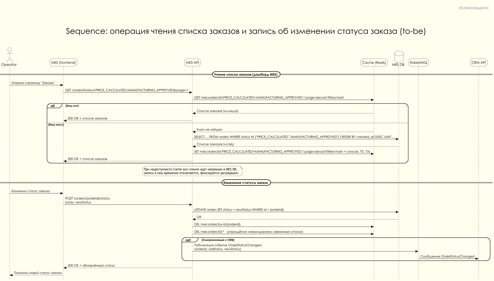

# Задание 5. Архитектурное решение по кешированию

---

## Анализ системы компании и C4-диаграммы в контексте кеширования

Система "Александрит" состоит из трёх основных приложений (онлайн магазин, CRM, MES) и очереди сообщений RabbitMQ для интеграции между CRM и MES. Кеширование имеет смысл там, где:

- много повторяющихся чтений одних и тех же данных
- запросы к БД тяжёлые или медленные
- к времени ответа предъявляются высокие требования, но допустима небольшая задержка обновления данных

С учётом результатов заданий 1-4 и C4 диаграмм, в первую очередь на кеширование кандидатами являются:

- **дашборд заказов в MES**:
  - операторы часто открывают первую страницу со списком "свежих" заказов
  - запросы по статусам и сортировкам "новые / в работе" выполняются очень часто
  - сейчас страница работает медленно, даже после внедрения пагинации и фильтров
  - данные сильно перекрываются между операторами (все видят одни и те же новые заказы)
- **агрегированные выборки заказов по статусам** в CRM и MES:
  - отчёты "заказы в работе", "завершённые заказы за период"
  - частые одинаковые фильтры по статусу и дате

Другие потенциальные места кеширования:

- **каталог интернет магазина** - классический кандидат, но он не является основным источником текущих проблем
- **результаты расчёта стоимости** - большинство 3d моделей уникальны, повторное использование готовой цены встречается редко, поэтому эффект от кеша будет ограниченным по сравнению с усложнением логики

С учётом ограниченных ресурсов команды и приоритета устранения текущих болей в этом решении фокус кеширования:

- список заказов для операторов MES (дашборд "заказы в работе")
- базовые данные по заказам, необходимые для быстрой отрисовки списка (идентификатор, статус, ключевые атрибуты без тяжёлых вычислений)

---

## Мотивация

Основные проблемы, которые должно решить кеширование:

- **медленная загрузка первой страницы MES**:
  - операторы жалуются, что дашборд заказов открывается слишком долго
  - это напрямую замедляет старт производства и ухудшает соблюдение сроков
- **рост нагрузки на MES DB при увеличении числа заказов и партнёров**:
  - каждый оператор и каждый внешний клиент косвенно создают повторяющиеся запросы к одним и тем же данным
  - без кеша единственная БД MES становится узким местом
- **непредсказуемое время ответа при пиковых нагрузках**:
  - в периоды наплыва заказов время ответа дашборда сильно "гуляет"
  - это делает невозможным стабильное соблюдение SLA по времени реакции операторов

Что даст кеширование:

- **стабильно быстрый дашборд MES**:
  - первая страница списка заказов (новые / в работе) будет отдаваться из кеша за миллисекунды
  - большинство операторских сценариев чтения станут обращениями к кешу, а не напрямую к БД
- **снижение нагрузки на базу данных MES**:
  - повторяющиеся запросы "последние N заказов по статусам" перестанут каждый раз бить в БД
  - больше ресурсов БД останется для операций записи и сложных выборок
- **улучшение бизнес показателей**:
  - более быстрое взятие заказов в работу операторами
  - меньшая очередь "невзятых" заказов
  - снижение доли заказов, которые "зависают" из-за того, что их поздно увидели в дашборде

---

## Предлагаемое решение

### Что именно кешируем

- **список заказов для дашборда MES**:
  - выборки "последние N заказов в статусах, интересных операторам" (например, `PRICE_CALCULATED`, `MANUFACTURING_APPROVED`, `MANUFACTURING_STARTED`)
  - результаты типовых запросов по статусу, дате создания и базовым фильтрам
  - укрупнённые "страницы" без тяжёлых связей и вычислений
- **детали заказа по идентификатору (точечно)**:
  - базовая карточка заказа (id, статус, ключевые атрибуты) для ускорения повторного открытия карточки

Мы **не** кешируем:

- чувствительные финансовые расчёты
- содержимое 3d моделей и другие тяжёлые бинарные данные
- редкие и сильно динамичные выборки, где выигрыш от кеша меньше риска устаревших данных

Причины:

- финансовые расчёты и связанные суммы должны всегда браться из источника истины (БД), чтобы избежать расхождений и спорных ситуаций с клиентами и партнёрами
- 3d модели и другие тяжёлые бинарные данные занимают много памяти и мало выигрывают от кеша по сравнению с использованием специализированного хранилища файлов
- для редких и постоянно меняющихся выборок коэффициент попаданий в кеш (cache hit ratio) будет низким, а риск показать устаревшие данные и усложнить логику выше потенциальной выгоды

### Тип кеширования

Для решения основной проблемы (медленный дашборд MES) выбираем **серверное кеширование**:

- кеш размещается рядом с MES API (например, отдельный Redis / управляемый Redis в облаке)
- логика работы с кешем полностью контролируется на стороне backend
- изменения прозрачны для фронтенда MES и других потребителей
- проще реализовать общую стратегию инвалидации для всех операторов

Клиентское кеширование (браузер, HTTP заголовки `Cache-Control`) можно использовать дополнительно для статики и справочников, но основным типом кеширования в этом решении является серверное.

### Выбор паттерна кеширования

Для чтения списков заказов в MES используем паттерн **Cache Aside (кеш сбоку)**:

- при запросе списка заказов MES API сначала обращается в кеш
- при промахе (cache miss) MES API читает данные из MES DB, записывает их в кеш и возвращает клиенту
- при повторных запросах в пределах времени жизни записи ответ отдается из кеша

**Почему Cache Aside подходит:**

- чтения (просмотр списков заказов) значительно преобладают над изменениями статусов
- при временной недоступности кеша система продолжает корректно работать с БД
- кеш не является источником истины, а только ускоряющей прослойкой
- логику легко адаптировать точечно для разных типов запросов

**Почему не Write Through:**

- каждое изменение статуса должно проходить и через кеш, и через БД, что усложняет жизненно важный поток записи
- задержка при записи в кеш в критическом пути может ухудшить устойчивость MES
- при проблемах с кешем Write Through либо ломает цепочку записей, либо требует сложных обходных путей

**Почему не Refresh Ahead (опережающее обновление):**

- требует точного прогнозирования, какие ключи нужно обновлять заранее
- создаёт дополнительную постоянную нагрузку на БД
- для первой итерации достаточно Cache Aside с коротким TTL и инвалидацией по ключу, а Refresh Ahead можно добавить позже для наиболее "горячих" ключей

### Архитектура кеша

- **Технология кеша**:
  - in-memory хранилище типа Redis как отдельный контейнер / управляемый сервис
  - доступ к нему имеет только MES API
- **Структура ключей**:
  - для списков: `mes:orders:list:{status-set}:{page}:{page-size}:{sort}:{filters-hash}`
  - для карточки заказа: `mes:orders:by-id:{order-id}`
- **Время жизни записей (TTL)**:
  - списки заказов для дашборда: 5-20 секунд (баланс свежести и разгрузки БД)
  - карточка заказа: 30-120 секунд (обновляется реже, чем списки)

Основной сценарий:

- при запросе списка заказов MES API:
  - формирует ключ по статусам, номеру страницы и фильтрам
  - пытается прочитать значение из кеша
  - при промахе читает из MES DB, кладёт результат в кеш с TTL и возвращает клиенту
- при изменении статуса заказа MES API:
  - обновляет запись в MES DB
  - инвалидирует или обновляет связанные ключи в кеше (подробнее в разделе "Стратегия инвалидации кеша")

Первая итерация внедрения кеша ограничивается только дашбордом MES. Агрегированные выборки в CRM, кеширование каталога интернет магазина и возможное кеширование результатов расчёта стоимости сохраняются в бэклог как следующие шаги, так как текущий приоритет - ускорить работу операторов и убрать узкое место в MES.

### Поведение при отказах кеша

При недоступности Redis (ошибка подключения, таймауты операций):

- MES API всегда выполняет чтения и записи через MES DB как источник истины
- попытки записи в кеш временно отключаются или сильно ограничиваются, чтобы не усугублять ситуацию
- фиксируются предупреждения в логах и метриках (ошибки кеша, рост латентности), чтобы команда видела деградацию

Таким образом, система переходит в режим "без кеша": SLA по времени ответа дашборда временно ухудшается до уровня "как раньше без кеша", но корректность данных и работоспособность сервиса сохраняются.

### Нефункциональные аспекты кеша

Оценка ожидаемого поведения:

- для первой страницы дашборда MES разумно ожидать высокий cache hit ratio (80-90 процентов и выше), так как:
  - операторы часто обновляют одни и те же статусы (`PRICE_CALCULATED`, `MANUFACTURING_APPROVED`, `MANUFACTURING_STARTED`)
  - множество операторов смотрят один и тот же пул свежих заказов
- порядок выигрыша по латентности:
  - без кеша: десятки-сотни миллисекунд на запрос в БД (в пиках - больше)
  - с кешем: единицы-десятки миллисекунд на запрос в Redis

Требования к Redis:

- размещение в приватной сети рядом с MES API (управляемый сервис в облаке c VPN, или селфхостед инстанс с фаерволлом)
- отказоустойчивость на уровне самого Redis (репликация, sentinel или кластер) и резервное копирование
- объём памяти:
  - храним только "плоские" списки заказов и небольшие карточки по id
  - суммарный объём измеряется десятками-сотнями мегабайт, а не гигабайтами
- политика eviction:
  - использование политики вроде volatile-lru или аналогичной
  - в сочетании с коротким TTL это позволяет автоматически очищать редко используемые ключи

---

## Диаграмма последовательности действий (Sequence diagram)

Диаграмма `order-status.puml` иллюстрирует:

- чтение списка заказов оператором MES с использованием кеша (Cache Aside)
- запись об изменении статуса заказа с обновлением БД и инвалидацией кеша
- упрощённое взаимодействие с очередью сообщений при смене статуса (для синхронизации с CRM)

Результат: [order-status.puml](order-status.puml)

---

## Cтратегия инвалидации кеша

Для баланса между производительностью и актуальностью данных используется **комбинированная стратегия**:

- **по ключу (программная инвалидация)** при изменении статуса заказа
- **по времени (TTL)** для защиты от накопления устаревших данных и упрощения логики

### Как работает инвалидация

- при изменении статуса заказа в MES API:
  - после успешного `UPDATE` в MES DB:
    - удаляется кеш по ключу `mes:orders:by-id:{order-id}`
    - инвалидируются ключи списков, где мог находиться заказ:
      - как минимум списки с предыдущим и новым статусом
      - для первой итерации допустимо инвалидировать все ключи `mes:orders:list:*`, чтобы не усложнять расчёт затронутых списков
  - при следующем запросе списка соответствующие данные перечитываются из БД и попадают в кеш
- короткий TTL гарантирует, что даже при пропущенной инвалидации устаревшие данные автоматически исчезнут из кеша через несколько секунд

В следующей итерации можно перейти к более точечной инвалидации:

- хранить списки раздельно по статусам и диапазонам страниц
- использовать версионирование списков (ключи вида `mes:orders:list:{status-set}:v{version}`) и при изменении статусов просто повышать версию, не проходя по всем ключам

Чтобы избежать шторма запросов к БД при массовой инвалидации, можно:

- добавлять небольшой разброс в TTL, чтобы разные ключи не протухали одновременно
- применять простую защиту от "догоняющего" чтения (например, не более одного запроса к БД на ключ одновременно, остальные ожидают результат)

### Сравнение стратегий инвалидации

| Стратегия | Плюсы | Минусы |
| :-------- | :---- | :----- |
| Только по времени (TTL) | Простая реализация, минимальная связность кода с кешем | При коротком TTL выигрыш от кеша ограничен, при длинном TTL дашборд может показывать слишком устаревшие данные |
| Только по ключу (программная) | Максимальная актуальность кеша, можно точечно обновлять только нужные ключи | Логика инвалидации становится сложной и легко ошибиться, особенно при множестве фильтров и страниц |
| Комбинированная (по ключу + TTL) | Баланс свежести данных и простоты реализации, кеш сам "заживает" после редких ошибок инвалидации | Требуется подобрать значения TTL под реальные SLA и нагрузку |

В контексте MES:

- важно, чтобы **операторы видели достаточно свежие данные**, но допускалась небольшая погрешность (несколько секунд)
- более критично обеспечить **стабильно быстрый отклик** и отсутствие перегрузки БД MES
- комбинированная стратегия (по ключу + TTL) даёт предсказуемое поведение и устойчивость к ошибкам в коде инвалидации, поэтому она выбрана как основная

Дополнительно:

- Redis располагается в приватной сети, доступен только из MES API и административных инструментов
- данные в транзите между MES API и Redis защищены (TLS)
- персональные данные в кеше живут ограниченное время (TTL) и не используются вне контекста работы MES, что снижает риск утечки или некорректного повторного использования
